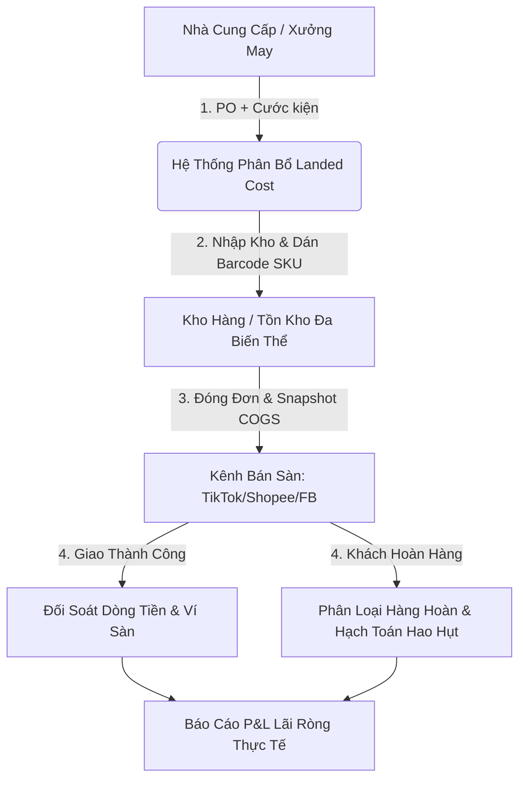
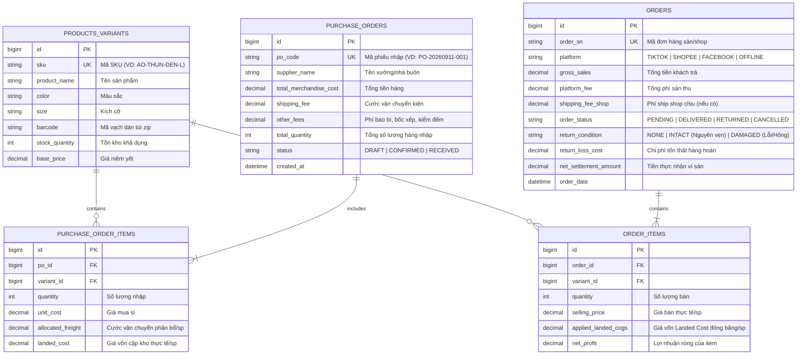

#  FashionRev-Ops: Hệ Thống Quản Lý Doanh Thu & Lợi Nhuận Thực Tế (Shop Thời Trang Online)

> **Giải pháp chuyển đổi số và quản trị tài chính - dòng tiền chuyên sâu dành cho mô hình kinh doanh quần áo may sẵn / nhập hàng sẵn (Fast-Fashion E-commerce).**

---

##  1. Bối Cảnh & Bài Toán Kinh Doanh Thực Tế (Business Context & Pain Points)

Kinh doanh thời trang online theo mô hình **nhập hàng may sẵn** có tốc độ xoay vòng vốn cực nhanh nhưng cũng tiềm ẩn rủi ro thất thoát biên lợi nhuận cao nhất trong ngành E-commerce bởi các đặc thù:

1. **Vòng đời sản phẩm ngắn (Hot Trend Lifecycle):** Một mẫu váy/áo thường chỉ "hot" trong 2–4 tuần. Nếu không nắm bắt chính xác tốc độ bán theo từng biến thể (Size/Màu/Form) và biên lãi ròng thực tế, lợi nhuận của đợt bán trước sẽ bị "chôn vùi" hoàn toàn vào tiền nhập hàng tồn đọng/hàng ế của đợt sau (*Bẫy "Doanh thu ảo - Tiền mặt âm"*).
2. **Giá vốn biến động liên tục (Dynamic Landed Cost):** Không có giá vốn cố định. Cùng 1 mẫu áo, đợt 1 nhập giá sỉ khác, đợt 2 nhập bổ sung cước xe/cân nặng tăng hoặc tỷ giá thay đổi. Cước kiện và chi phí phụ luôn thay đổi theo từng đợt nhập.
3. **Chi phí ẩn và hàng hoàn (Returns & Hidden Leakage):** Tỷ lệ hoàn ngành thời trang dao động 15% - 30%. Tổn thất không chỉ là cước ship 2 chiều mà còn là túi bọc hỏng, tem mác rách, chi phí ủi/xử lý lại, thậm chí mất trắng 100% giá vốn nếu hàng bị bẩn/rách/tráo.
4. **Phí sàn trừ ngầm (Platform Fee Creep):** Phí cố định, phí thanh toán, phí freeship extra, phạt vượt cân nặng thực tế... trên TikTok Shop / Shopee / Lazada thường làm thất thoát 3% – 7% doanh thu nếu không đối soát từng đơn.

---

##  2. Trụ Cột Cốt Lõi Của Hệ Thống (Core System Pillars)

### 🔹 1. Tự Động Tính Giá Vốn Cập Kho (Landed Cost Engine)
Phân bổ tự động và chính xác mọi chi phí phát sinh khi hàng về kho:
$$\text{Landed Cost}_{\text{SKU}} = \text{Giá Mua Sỉ} + \frac{\text{Tổng Cước Vận Chuyển Kiện} + \text{Phí Kiểm Đếm/Tỷ Giá}}{\text{Tổng Số Lượng Nhập}} + \text{Chi Phí Tem/Túi Zip}$$

### 🔹 2. Trừ Giá Vốn Xuất Kho Chính Xác (FIFO & COGS Snapshot)
Áp dụng nguyên tắc **Nhập trước - Xuất trước (FIFO)** theo từng lô nhập:
- *Ví dụ:* Lô 1 nhập 100 áo giá 90.000đ; Lô 2 nhập 200 áo giá 105.000đ (do khan hàng). 
- Khi phát sinh đơn bán, hệ thống trừ đúng giá vốn theo lô tương ứng và **"đóng băng" (COGS Snapshot)** vào đơn hàng tại thời điểm xuất để bảo toàn tính toàn vẹn dữ liệu tài chính lịch sử.

### 🔹 3. Xử Lý & Hạch Toán Tổn Thất Hàng Hoàn (Return Loss Accounting)
Khi bưu tá trả kiện hàng hoàn về kho, hệ thống phân loại tài chính theo 2 luồng:
- **Hàng nguyên vẹn:** Nhập lại kho bán tiếp $\rightarrow$ Ghi nhận chi phí mất đi = `Cước vận chuyển 2 chiều` + `Phí bao bì/túi zip hư hao` + `Chi phí nhân công đóng/kiểm`.
- **Hàng rách / dơ / bị tráo (Hàng lỗi):** Chuyển sang kho xả lỗi $\rightarrow$ Ghi nhận **mất đứt 100% giá vốn món đồ** vào chi phí hao hụt kỳ đó.

### 🔹 4. Khớp Lệnh Dòng Tiền Sàn & Bóc Trần Phí Ẩn (Settlement & Reconciliation)
So khớp 1:1 giữa mã đơn sàn, tiền thực nhận về tài khoản ngân hàng và sao kê ví sàn nhằm phát hiện tức thì các sai lệch: trừ sai cân nặng kiện hàng, phạt SLA, sai chính sách voucher tài trợ.

---

##  3. Phạm Vi Triển Khai Trọng Tâm (MVP Scope - 11/09/2026)

Hệ thống ưu tiên xây dựng **2 chức năng xương sống** quyết định độ chính xác của toàn bộ dữ liệu tài chính:

###  Chức Năng 1: Quản Lý Phiếu Nhập & Tự Động Tính Giá Vốn Cập Kho (Inbound Orders & Landed Cost)
* **Lý do lựa chọn:** Không có giá vốn chuẩn xác thì mọi báo cáo lãi lỗ đầu ra đều vô nghĩa.
* **Nghiệp vụ chi tiết:**
  - Khởi tạo Phiếu nhập hàng (Purchase Order - PO) gắn với Nhà cung cấp.
  - Nhập chi tiết danh sách SKU (Mẫu - Màu - Size), số lượng, đơn giá mua sỉ.
  - Khai báo chi phí vận chuyển kiện hàng, cước xe tải, phụ phí đóng gói riêng.
  - Tự động phân bổ chi phí kiện hàng vào từng sản phẩm theo tỷ lệ số lượng hoặc giá trị.
  - Sinh mã vạch (Barcode) theo chuẩn SKU nội bộ để in tem dán trực tiếp lên túi zip.

###  Chức Năng 2: Quản Lý Đơn Bán & Tính Lợi Nhuận Ròng Theo Đơn (Order Settlement & Net Profit Engine)
* **Lý do lựa chọn:** Trả lời trực tiếp câu hỏi sống còn của chủ shop: *"Mỗi đơn hàng bán ra thực chất đang lời hay lỗ bao nhiêu tiền?"*
* **Nghiệp vụ chi tiết:**
  - Tiếp nhận đơn bán từ các kênh (Shopee, TikTok Shop, Facebook Pos).
  - Tự động trừ tồn kho theo FIFO và gắn `applied_landed_cogs` vào từng `order_item`.
  - Tự động bóc tách doanh thu và các dòng chi phí:
    $$\text{Lợi Nhuận Ròng Đơn} = \text{Doanh Thu Thực Nhận} - \text{Giá Vốn Cập Kho (COGS)} - \text{Phí Sàn} - \text{Chi Phí Bao Bì} - \text{Tổn Thất Hoàn (nếu có)}$$
  - Báo cáo thời gian thực biên lợi nhuận ròng (Net Margin %) trên từng đơn và từng dòng sản phẩm.

---

##  4. Thiết Kế Cơ Sở Dữ Liệu (Database Schema)

Hệ thống thiết kế theo chuẩn CSDL quan hệ tối ưu hóa cho bài toán thương mại điện tử:

---

##  5. Phân Quyền Người Dùng (Role-Based Access Control)

| Vai trò (Role) | Trách nhiệm chính | Quyền hạn trên hệ thống |
| :--- | :--- | :--- |
| **Chủ Shop (Owner / Admin)** | Ra quyết định nhập hàng, duyệt chiến lược giá, quản trị lãi/lỗ | Toàn quyền; xem báo cáo P&L, tỷ lệ hoàn, tốc độ quay vòng vốn |
| **Kế Toán Đối Soát (Accountant)** | Kiểm tra dòng tiền, sao kê ví sàn, kiểm toán giá vốn | Đối soát đơn hàng, tạo phiếu chi phí ngoài, quản lý sổ quỹ |
| **Quản Lý Kho / Vận Hành (Ops Lead)** | Nhập kho, in mã vạch, xử lý phân loại hàng hoàn | Tạo PO nhập hàng, in tem Barcode, quét barcode kiểm hàng hoàn |
| **Trưởng Phòng Marketing (Media Lead)** | Tối ưu chi phí quảng cáo (Ads), xác định mẫu trend | Xem biên lãi ròng theo SKU để phân bổ ngân sách chạy ads |

---

##  6. Lộ Trình Phát Triển Toàn Diện (Product Roadmap)

- [x] **Giai đoạn 1 (11/09/2026 - Core Inbound & Landed Cost Engine):**
  - Quản lý danh mục Sản phẩm & Biến thể đa thuộc tính (Màu, Size, SKU).
  - Nghiệp vụ Phiếu nhập (PO) và phân bổ cước kiện tự động ra Landed Cost.
  - Quản lý đơn bán hàng và Snapshot giá vốn từng đơn.
- [ ] **Giai đoạn 2 (Return Operations & Reconciliation):**
  - Module quét mã vận đơn phân loại hàng hoàn (Nguyên tem vs Hàng hỏng).
  - Tự động đối soát file Excel sao kê ví Shopee / TikTok Shop.
- [ ] **Giai đoạn 3 (Inventory Turnover & Deadstock Intelligence):**
  - Báo cáo phân tích tốc độ thoát hàng theo SKU.
  - Cảnh báo hàng tồn kho quá 20 ngày (Deadstock Alert) để lên kịch bản xả lỗ kịp thời.

---

##  7. Hướng Dẫn Cài Đặt & Sử Dụng (Getting Started)

### Yêu Cầu Môi Trường
- Python 3.10+ / Node.js 18+ (Tùy chọn backend stack)
- Database: PostgreSQL / MySQL / SQLite

### Quy Trình Vận Hành Mẫu
1. **Bước 1:** Khởi tạo danh mục sản phẩm và biến thể SKU.
2. **Bước 2:** Tạo Phiếu Nhập Hàng (PO), nhập giá mua sỉ + tổng tiền cước xe tải chuyển hàng về kho $\rightarrow$ Hệ thống tự động tính **Landed Cost**.
3. **Bước 3:** In tem barcode dán túi zip cho từng sản phẩm.
4. **Bước 4:** Khi có đơn hàng từ sàn, tạo đơn bán và xác nhận xuất kho $\rightarrow$ Hệ thống tự động khóa giá vốn và tính toán lãi ròng tức thì.

---

