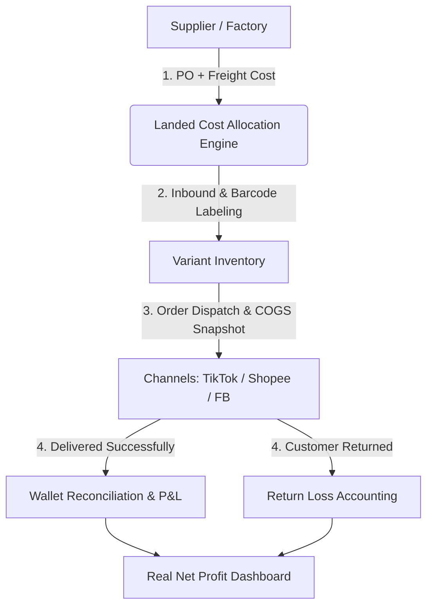

# FashionRev-Ops: Revenue & Net Profit Management System

> **Financial & operational management platform tailored for fast-fashion online retail (Ready-to-wear / Pre-stocked apparel).**

---

## 1. Business Context & Core Problems

Fast-fashion e-commerce operates on rapid inventory turnover but faces severe margin leakage risks:

1. **Short Trend Lifecycle:** Apparel trends last only 2–4 weeks. Without real-time tracking of net margins and velocity by variant (Size/Color/Form), previous profits get trapped in slow-moving stock (*"Paper Profit, Negative Cash Flow"*).
2. **Volatile Landed Costs:** Wholesale prices, freight charges, and currency rates fluctuate per batch. COGS cannot be treated as a static number.
3. **High Return Rates (15%–30%):** Returns cause 2-way shipping costs, damaged packaging, rework labor, and complete COGS loss for unsellable items.
4. **Marketplace Fee Leakage:** Undetected overcharges (weight discrepancies, shifting platform fees, campaign deductions) erode 3%–7% of revenue.

---

## 2. Core System Pillars

### Landed Cost Allocation
Automatically allocates freight and packaging into each unit cost:
$$\text{Landed Cost}_{\text{SKU}} = \text{Wholesale Price} + \frac{\text{Total Inbound Freight} + \text{Handling Fees}}{\text{Total Units Received}} + \text{Packaging/Tag Cost}$$

### Accurate FIFO & COGS Snapshot
- Depletes inventory based on **First-In, First-Out (FIFO)** per batch.
- Freezes (`applied_landed_cogs`) onto each order item at fulfillment time to maintain historical reporting integrity.

### Return Loss Accounting
- **Intact returns:** Restocked. Loss recorded = 2-way shipping + damaged polybags + rework cost.
- **Damaged/Swapped items:** Moved to clearance. **100% COGS loss** is booked immediately.

### Marketplace Reconciliation
Matches bank payouts with order records to uncover weight penalties, campaign fee discrepancies, and payment gateway charges.

---

## 3. Core Scope (MVP - 11/09/2026)

### Feature 1: Inbound Purchase Orders & Landed Cost Engine
* **Purpose:** Ensures accurate unit cost before any stock enters inventory.
* **Key Capabilities:**
  - Create Purchase Orders (PO) linked to suppliers.
  - Enter SKU breakdown (Model - Color - Size), quantities, and wholesale costs.
  - Automatically allocate freight/handling fees across items.
  - Generate SKU barcodes for polybag labeling.

### Feature 2: Order Fulfillment & Real-Time Net Profit Engine
* **Purpose:** Directly answers: *"How much net profit did each order actually generate?"*
* **Key Capabilities:**
  - Ingest orders from Shopee, TikTok Shop, and Facebook POS.
  - Deduct stock via FIFO and freeze unit COGS at dispatch.
  - Calculate real-time net profit per order:
    $$\text{Net Profit} = \text{Net Payout} - \text{Landed COGS} - \text{Platform Fees} - \text{Packaging} - \text{Return Losses}$$

---

## 4. Database Schema

---

## 5. Role-Based Access Control (RBAC)

| Role | Key Responsibility | System Permissions |
| :--- | :--- | :--- |
| **Owner / Admin** | Overall profitability, strategic pricing, inventory budget | Full access; view real-time P&L, return rate & turnover metrics |
| **Accountant** | Cashflow reconciliation, fee audit, expense tracking | Reconcile marketplace payouts, record OPEX & ledger entries |
| **Operations / Warehouse** | Inbound receiving, barcode labeling, return grading | Manage POs, print SKU barcodes, process return inspections |
| **Marketing Lead** | Ads performance, product trend analysis | Access item-level net margin to optimize ROAS & ad budget |

---

## 6. Implementation Roadmap

- [x] **Phase 1 (11/09/2026 - Core Inbound & Landed Cost Engine):**
  - Variant catalog management (SKU, Color, Size, Barcode).
  - PO creation with automated Landed Cost allocation.
  - Order fulfillment with FIFO COGS snapshot & margin calculation.
- [ ] **Phase 2 (Return Operations & Reconciliation):**
  - Barcode scanner integration for return triage (Intact vs Damaged).
  - Automated statement import for Shopee / TikTok Shop fee reconciliation.
- [ ] **Phase 3 (Inventory Velocity & Deadstock Intelligence):**
  - SKU-level sales velocity tracking.
  - 20-day slow-moving/deadstock alerts to trigger markdown workflows.

---

## 7. Getting Started

### Prerequisites
- Python 3.10+ / Node.js 18+
- Relational Database: PostgreSQL / MySQL / SQLite

### Standard Workflow
1. **Step 1:** Create product catalog and define variant SKUs.
2. **Step 2:** Generate Purchase Order (PO) with wholesale costs and freight fee $\rightarrow$ System auto-calculates **Landed Cost**.
3. **Step 3:** Print SKU barcode labels and attach them to polybags upon receiving.
4. **Step 4:** Fulfill incoming sales orders $\rightarrow$ System freezes COGS via FIFO and calculates net profit per item in real time.
