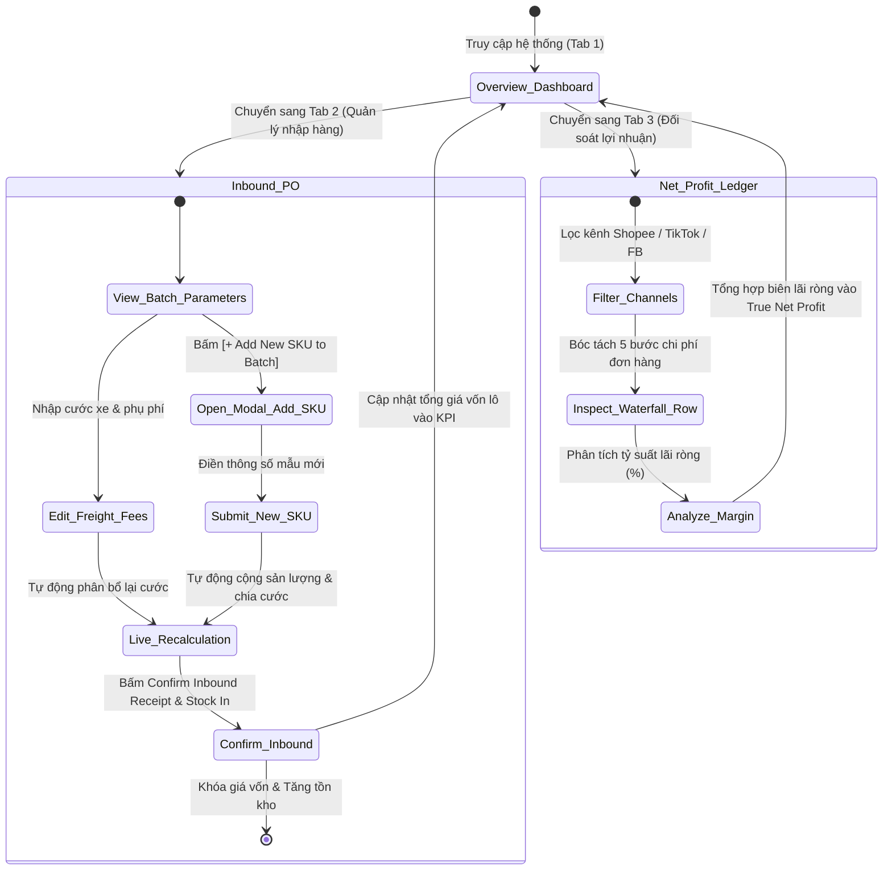

#  Kiến Trúc Thông Tin (Information Architecture - IA)

> **Hệ thống:** FashionRev-Ops - Quản lý Doanh thu & Lợi nhuận Ròng Shop Thời Trang  
> **Cấu trúc điều hướng:** 3 Tabs Màn hình chính bao quát **3 Tính năng cốt lõi**.

---

## 1. Sơ Đồ Cây Kiến Trúc Thông Tin Toàn Hệ Thống

```plaintext
FASHIONREV-OPS SYSTEM ARCHITECTURE (IA TREE)
│
├── [HEADER] Thanh Điều Hướng & Trạng Thái Hệ Thống
│   ├── Brand Identity: Logo "FRO" + Tên hệ thống + Slogan quản trị dòng tiền
│   ├── Tab Navigation Bar:
│   │   ├── Tab 1: Overview Dashboard (Tổng quan hoạt động & Lợi nhuận)
│   │   ├── Tab 2: Inbound Landed Cost (Nhập hàng & Phân bổ giá vốn)
│   │   └── Tab 3: Order Net Profit (Thác nước lợi nhuận ròng đa sàn)
│   ├── System Health & Channel Indicator: Tan Binh Warehouse • TikTok / Shopee / FB Connected
│   └── User Profile Card: Avatar "HL" + Hương Ly (Shop Owner / Admin)
│
├── [TAB 1] Màn Hình Tổng Quan Dashboard (Executive Dashboard)
│   ├── 1.1 Khối 4 KPI Tài Chính Cốt Lõi (Top Financial KPI Summary):
│   │   ├── Thẻ 1: Tổng doanh thu sàn (Gross Revenue) + Tỷ trọng sàn (Shopee / TikTok / FB)
│   │   ├── Thẻ 2: Tổng giá vốn cập kho (Total Inbound COGS) + Sản lượng xuất bán (orders)
│   │   ├── Thẻ 3: Tổng phí sàn & bao bì (Platform & Packaging Fees) + Tỷ lệ chi phí (%)
│   │   └── Thẻ 4: Lợi nhuận ròng thực tế (True Net Profit) + Biên lãi ròng (Net Margin %)
│   │
│   ├── 1.2 Khối Tóm Tắt Phân Bổ Landed Cost (Inbound Quick Widget):
│   │   ├── Lựa chọn xưởng may / Nhà cung cấp
│   │   ├── Cước xe tải & Phí túi zip tem mác
│   │   ├── Khung công thức giá vốn thời gian thực (Formula Callout)
│   │   ├── Bảng rút gọn danh mục hàng nhập
│   │   └── Nút tắt: "Confirm Inbound & Generate Barcodes" + "Add New SKU / Model"
│   │
│   └── 1.3 Khối Tóm Tắt Thác Nước Đơn Bán (Order Waterfall Stream):
│       └── Danh sách thẻ đơn hàng đa kênh (Khách trả -> Phí sàn -> Túi gói -> COGS -> Lãi ròng)
│
├── [TAB 2] Màn Hình Nhập Hàng & Phân Bổ Giá Vốn (Inbound Landed Cost Engine)
│   ├── 2.1 Thanh Breadcrumb & Thao Tác Nhanh:
│   │   ├── Điều hướng: Warehouse Management / Inbound POs / Mã PO
│   │   ├── Trạng thái: DRAFTING PO / RECEIVED
│   │   └── Nút chức năng: "Inbound PO History" + "Sync to ERP / Accounting"
│   │
│   ├── 2.2 Cột Trái — Thông Số Lô Hàng Nhập (Batch Parameters):
│   │   ├── Dropdown: Nhà cung cấp / Xưởng may (Địa chỉ, số điện thoại, trạng thái đối soát)
│   │   ├── Input: Cước xe tải vận chuyển (VND/chuyến)
│   │   ├── Input: Phí bốc xếp & kiểm đếm đầu bao (VND)
│   │   ├── Input: Phí túi zip & tem barcode (VND/chiếc)
│   │   └── Box hiển thị: Tổng sản lượng toàn lô (Total Batch Quantity pcs)
│   │
│   ├── 2.3 Cột Phải — Xem Trước Phân Bổ Thời Gian Thực (Real-Time Allocation Preview):
│   │   ├── Thẻ 1: Phân bổ cước xe tải bình quân (+VND/chiếc)
│   │   ├── Thẻ 2: Phân bổ phí bốc xếp (+VND/chiếc)
│   │   ├── Khung tiêu điểm (Landed Cost Spotlight): Đơn giá vốn cập kho tiêu chuẩn (VND/chiếc)
│   │   └── Biểu đồ cơ cấu chi phí thực tế (Thanh 3 màu: Giá sỉ % + Cước xe % + Túi zip %)
│   │
│   ├── 2.4 Bảng Chi Tiết Biến Thể SKU Trong Lô (Itemized SKU Table):
│   │   ├── Thanh công cụ (Toolbar):
│   │   │   ├── Ô tìm kiếm theo mã SKU, tên sản phẩm
│   │   │   ├── Bộ lọc Size động (All, Size M, Size L, Size XL, Free Size...)
│   │   │   ├── Nút: [➕ Add New SKU to Batch] (Mở Modal thêm mẫu mới)
│   │   │   └── Bộ đếm số lượng SKU hiển thị
│   │   ├── Cột dữ liệu: SKU Code | Product Name | Size | Quantity | Wholesale | Freight Alloc | Pkg Fee | Landed Cost | Projected Stock | Actions
│   │   ├── Nút hành động từng dòng: [Edit] (sửa số lượng) + [✕] (xóa khỏi lô)
│   │   └── Thanh tổng kết (Summary Bar): Cước bình quân, Tổng tiền sỉ, Tổng phụ phí, TỔNG GIÁ TRỊ LÔ
│   │
│   ├── 2.5 Hộp Thoại Modal Thêm Mẫu Mới (Add New SKU Modal):
│   │   ├── Input: Mã SKU, Phân loại/Size, Tên sản phẩm, Chi tiết chất liệu vải
│   │   ├── Input: Số lượng nhập, Đơn giá mua sỉ, Tồn kho ban đầu
│   │   ├── Live Projected Landed Cost: Tự tính trước giá vốn dự kiến
│   │   └── Nút hành động: [Cancel] + [+ Add to Inbound Batch]
│   │
│   └── 2.6 Thanh Thao Tác Cuối Trang (Bottom Action Bar):
│       ├── Nút: Hủy bỏ, Lưu nháp phiếu, In bảng kê mã vạch QR
│       └── Nút CTA chính: "Confirm Inbound Receipt & Stock In"
│
└── [TAB 3] Màn Hình Thác Nước Lợi Nhuận Đơn Hàng (Order Net Profit Waterfall)
    ├── 3.1 Tiêu Đề & Chỉ Số Hiệu Suất Biên Lãi:
    │   ├── Thẻ KPI: Tỷ suất lợi nhuận ròng trung bình (Average Net Margin %)
    │   └── Thẻ KPI: Tổng số đơn hàng hoàn thành (Fulfilled Orders)
    │
    ├── 3.2 Thanh Lọc Kênh Bán & Trạng Thái Lãi:
    │   ├── Tabs lọc sàn TMĐT: [Tất cả kênh] | [TikTok Shop] | [Shopee] | [Facebook POS]
    │   ├── Kỳ đối soát: This Month (01/10 - 31/10)
    │   ├── Ô tìm kiếm: Mã đơn hàng, Tên sản phẩm, SKU
    │   └── Nút lọc biên lãi: [Lãi cao >40%] | [Lãi thấp <20%] | [Đơn hàng lỗ]
    │
    └── 3.3 Bảng Thác Nước Lợi Nhuận Từng Đơn (Order Waterfall Ledger Table):
        └── 7 Cột khấu trừ: Mã đơn & Kênh | Sản phẩm & SKU | Doanh thu thuần | Phí sàn & Voucher | Landed COGS đóng băng | Vật tư gói hàng | LỢI NHUẬN RÒNG ĐÚT TÚI (Kèm thanh % biên lãi)
```

---

## 2. Luồng Trải Nghiệm Người Dùng (Screen Flow Diagram)


